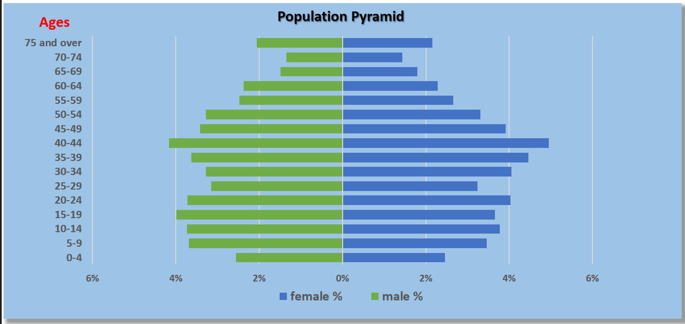
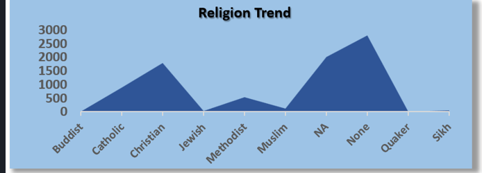
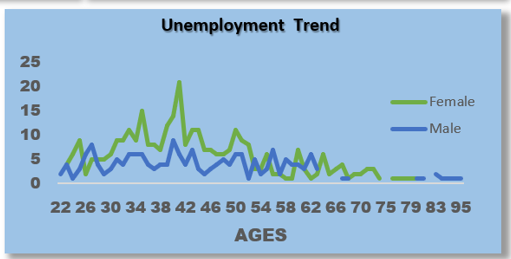
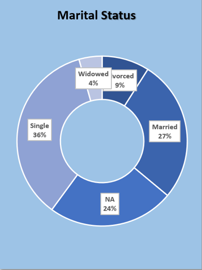
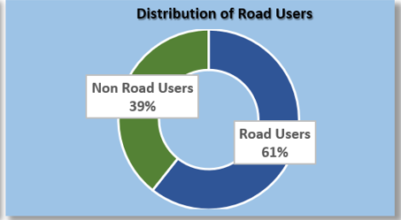
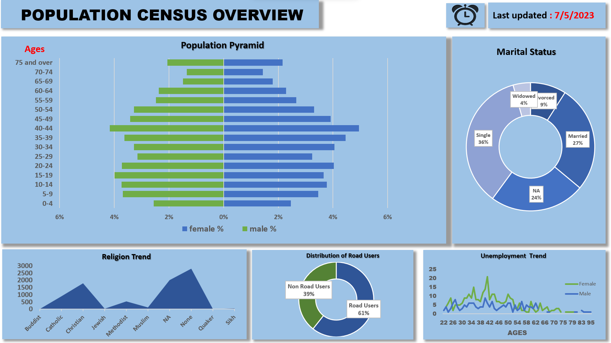

# Community-Development-Project 
***

## Introduction
***
This is a Microsoft Excel project on the Development of a community. This project involves the analyzes of the population dataset collected from a a given community and make recommendations based on the findings, to guide the decision making of the stakeholders for the community.  
__Disclaimer__: All datasets and reports do not represent any Community, state or country, but just a dummy dataset to demonstrate capabilities of Microsoft Excel.

## Problem Statement
***

The Stakeholders of a community are faced with various options on project to invest in for the residents of a community. Therefore, you are to uncover insights from the dataset given and make recommendations on the best project to invest in that will be beneficial to the residents for the stakeholders.

## Skills Demonstrated
***

The skills demonstrated on this project are:
- Data Cleaning,
- Pivot Table,
- Data Analysis,
- Data Visualization.

## Data Sourcing
***

The dataset used was provided by the stakeholders of the Community. Data on the criteriaS below for 8330 residents of the community were provided.

- Street name,
- First name,
- Surname,
- Age,
- Relationship to the Head of house,
- Marital Status,
- Gender,
- Occupation,
- Religion and
- Infirmity.

## Analyses and Visualization
  ***

  

 - The population pyramid depicts that the population structure of the community is that of an ageing population; characterized 
   with low birth rate,low death rate and long life expectancy.
 - On an average,the female gender lives longer than their male counterpart.
 ***

  

  - Majority of the residents of the community did not subscribe to any religion (None and NA).
  - Christianity and Catholicism are the 2nd and 3rd majorly subscribed religion in the community respectively.
  ***

  
  - 6.25%(513 residents) of the total population are unemployed.
  - The females are mostly unemployed at age 41 while the male are mostly unemployed at age 40, but not as much as the female.
    
  ***

   

   - Majority of the residents of the community are single.
   ***
     
     
   
   - 61% of the residents of the town uses the road on a daily basis.
   ***

   ### A Single page Consolidated Report of the Community Population Analysis
   ***
   
   

   ## Conclusions and Recommendations
   ***
   Based on the findings from the report above, the followings are recommended;
   1. More funds should be allocated for end of life care,as this will cater for the needs of the increasing number of old ages 
      and retirees in the nearest future.
    
   2. Railway Station(train) should be created as an alternative means of transportation, as this will reduce pressure on the 
      road. In addition,it will also reduce unemployment in the community through creation of jobs such as ;
      
      * train operator,
      * train cook,
      * train yard manager,
      * ticket seller,
      * train mechanic,
      * Dispatcher,
      * train conductor etc.

  * *__NOTE: Railway is recommended because there are no evidence of waterways in the community.__*

  
   

   
   The image above depicts the joyous mood of the residents of the community after the stakeholders have implemented what was 
   recommended, which is having a great impact on the youth, thereby decreasing unemployment in the community to about 1.5% of 
   the total Population(123 residents).
   ***
   ## THANK YOU FOR STAYING
   ## 🥰🥰🥰
   

    
 
  
   
   

     

   

   

  
  
